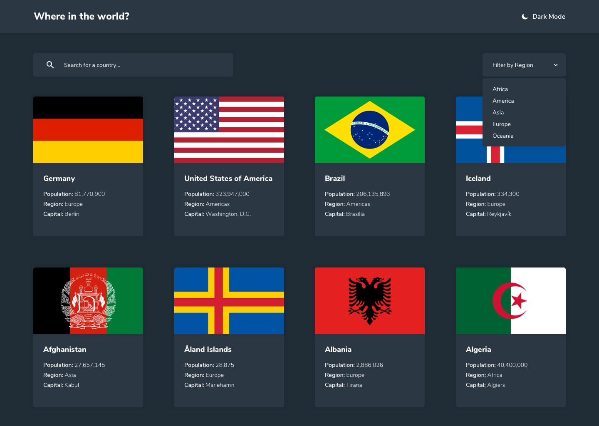

# Project Title

Rest Countries API With color Theme Switcher

## Demo link:

https://quizzical-golick-db2910.netlify.app/rest-countries-api-with-color-theme-switcher-master/build/

## Table of Content:

- [About The App](#about-the-app)
- [Screenshots](#screenshots)
- [Technologies](#technologies)
- [Setup](#setup)
- [Approach](#approach)
- [Credits](#credits)

## About The App

Challenge from frontendmentor.io

## Screenshots

## Technologies

I used `html`, `styled-components`, `React JS` (my frist project), `fetch API`, `React Hooks`, and `Context API`.

## Setup

- download or clone the repository

## Approach

I have used https://restcountries.eu/ Public APi that gives me countries all information.

This page have Local Storage save persist (dark mode) and information about all countries.

## Credits

List of contriubutors:

- [Florian Kutschera](https://medium.com/@Florian/freebie-google-material-design-shadow-helper-2a0501295a2d#.wyvbmcq10)
- [developedbyed](https://www.youtube.com/c/DevEd/videos)
- [Brad Traversy](https://www.youtube.com/channel/UC29ju8bIPH5as8OGnQzwJyA)
- [@divyanshu0x16](https://www.frontendmentor.io/profile/divyanshu0x16)
