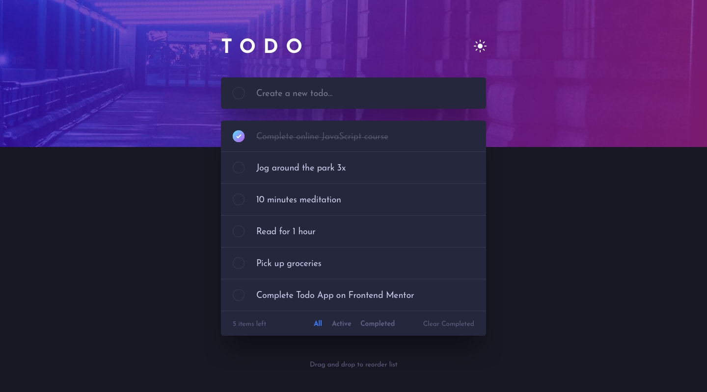

# Project Title

Todo App

## Demo link:

https://quizzical-golick-db2910.netlify.app/todo-app-main/index.html

## Table of Content:

- [About The App](#about-the-app)
- [Screenshots](#screenshots)
- [Technologies](#technologies)
- [Setup](#setup)
- [Approach](#approach)
- [Credits](#credits)

## About The App

Challenge from fronendmentor.io

## Screenshots

## Technologies

I used `html`, `css` and `Js`

## Setup

- download or clone the repository

## Approach

I adopted Sortable.js to dragable todos, animate css for some animations, sweet alert to alerts on page. The app have counter character that show dinamically how many characters left.

The use with keyboard will be implemented as soon as posible.

## Credits

List of contriubutors:

- [Florian Kutschera](https://medium.com/@Florian/freebie-google-material-design-shadow-helper-2a0501295a2d#.wyvbmcq10)
- [developedbyed](https://www.youtube.com/c/DevEd/videos)
- [Origamid](https://www.origamid.com/projetos/css-grid-layout-guia-completo/)
